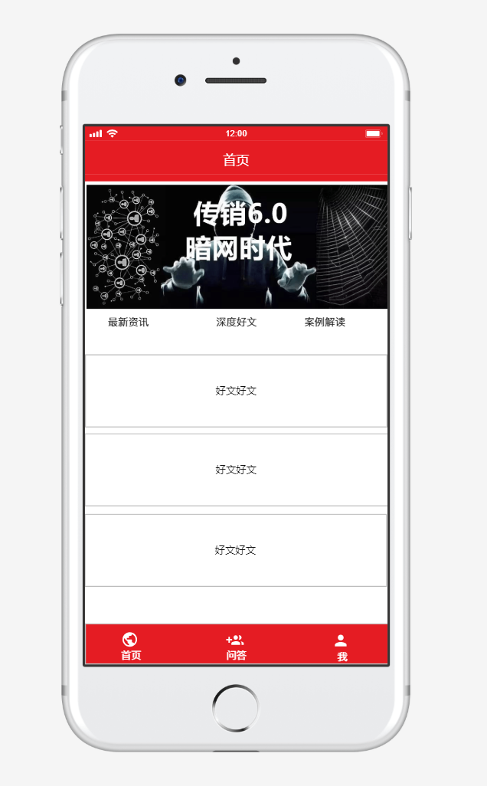
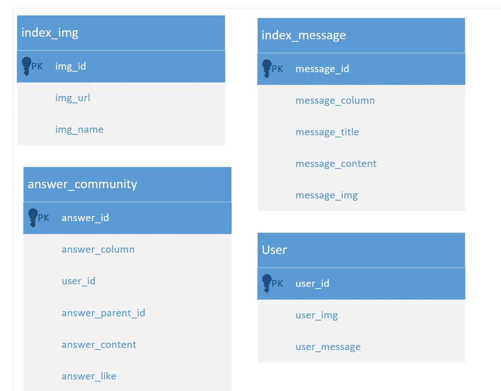

# 需求分析

### 首页

1.大图轮换展示，能实现根据页面跳转到文章，所以需要配置图片+文章路径；初期可写死；后期需要做控制台；

2.咨讯展示：分别为最新咨询、深度好文、案例解读 对应的栏目下要实现对应的文章，文章来源信息需要收集；资讯不进行评论，点进去看就行了。

### 问答社区

1.发布问题

2.点赞

3.评论

4.删除自己的问题

5.删除自己的提问

### 我的

1.我的问答，查询和自己有关的问题和答案；

2.关于我们，展示与我们相关的信息

3.问题反馈，点进去给我们留言。

# UI设计图

### 首页

### 问答社区

### 我的

# 关系型数据库设计

### UML图

### 首页

1.index_img这个表主要存储了大图存储地址和名称还有跳转地址。

2.index_message这个表存储了信息所属栏目、信息标题、信息内容、信息缩略图

### 问答社区

1.一张关于问答社区的表，需要实现发布、点赞、评论。其中字段包括问答所属栏目（提问、回答）、用户id、父id(针对评论和点赞)、问答内容、点赞（0或1）

2.具体分析每个功能：

* 发布：answer_id自动递增、answer_column为0代表问题，user_id为用户id、answer_parent_id默认为0，answer_content为问题内容、喜欢默认为0即不喜欢。
* 评论：answer_id自动递增、answer_column为1代表评论、user_id为用户id、answer_parent_id为获取当前评论内容的id、answer_content为评论内容、answer_like默认为0；
* 点赞：anser_id自动递增、answer_column为2代表点赞、user_id为用户id、anser_parent_id为点赞文章id、answer_content为空、anser_like默认为1；

* 问答社区首页问题：查找answer_column为0、根据user_id查找头像、根据查找anser_column为3且parent_id为answer_id且answer_like为1的数据，获取点赞个数、如果该user_id下有点赞数据，则为红心、同理查询评论数。初始页面查询3-5条，下拉继续刷新。

### 我的

1.我的问答：查询该用户下，所有与该用户有关的问题。及回答。

2.关于我们：一个信息展示页面；

3.问题反馈、有个输入框、完成之后就行了，假的也行。 如果要存到数据库里面的话，也行，直接用answer_库